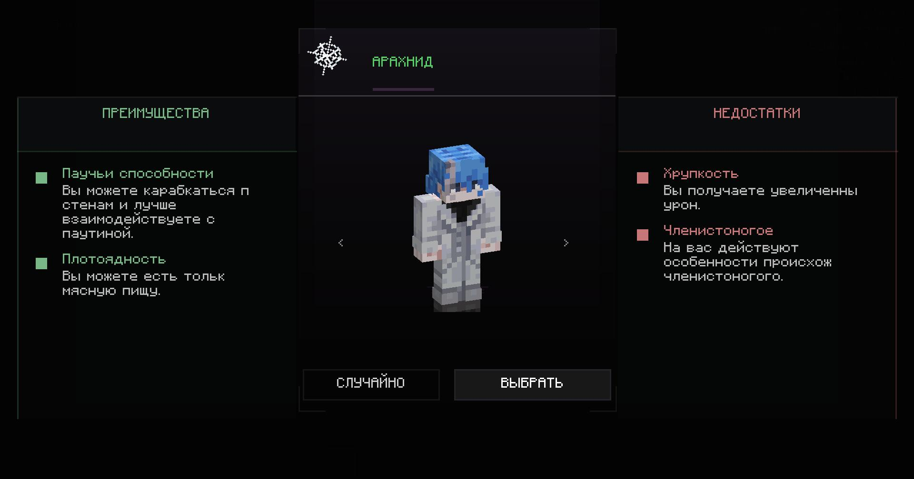

# Origins: Reimagined

> Клиент-серверный Fabric-аддон для Origins: Legacy: переработанный экран выбора, улучшенные механики происхождений, логичные отношения мобов и расширенные визуальные профили.


[](LICENSE)

**Origins: Reimagined** переосмысливает стандартные происхождения из **Origins: Legacy**, исправляет проблемные механики и делает их преимущества и недостатки более логичными, полезными и пригодными для обычного выживания.

Мод не заменяет Origins новой системой. Он сохраняет знакомые происхождения и совместимость с Origins: Legacy, но улучшает интерфейс, поведение способностей, взаимодействие с миром и отношение связанных мобов.

> Сделать происхождения действительно разными, не превращая их недостатки в запрет играть в Minecraft.

<p align="center">
  
</p>

---

## ⚡ Быстрые переходы

- [Что это такое](#что-это-такое)
- [Основные возможности](#основные-возможности)
- [Меню выбора происхождения](#меню-выбора-происхождения)
- [Отношения мобов к происхождениям](#отношения-мобов-к-происхождениям)
- [Переработанные происхождения](#переработанные-происхождения)
  - [Phantom](#phantom)
  - [Elytrian](#elytrian)
  - [Arachnid](#arachnid)
  - [Merling](#merling)
- [Как это работает](#как-это-работает)
- [Установка](#установка)
- [Сборка из исходников](#сборка-из-исходников)
- [Совместимость](#совместимость)
- [Статус разработки](#статус-разработки)
- [Известные ограничения](#известные-ограничения)
- [Сообщения об ошибках](#сообщения-об-ошибках)
- [Credits](#credits)
- [Лицензия и disclaimer](#лицензия-и-disclaimer)

---

## Что это такое

В стандартном Origins некоторые происхождения предлагают интересную идею, но на практике оказываются либо слишком сильными, либо настолько ограниченными, что нормальное прохождение превращается в мучение.

Примеры:

- Merling почти не способен самостоятельно начать развитие на суше;
- Elytrian получает тяжёлые ограничения, но не может свободно управлять собственным полётом;
- родственные мобы атакуют игроков соответствующего происхождения без логичной причины;
- солнечные механики Phantom зависят от странных проверок положения игрока;
- часть описаний способностей не полностью соответствует реальному поведению.

**Origins: Reimagined** исправляет такие проблемы точечно, не переписывая Origins: Legacy целиком.

Проект развивается в трёх основных направлениях:

1. переработка интерфейса выбора происхождения;
2. исправление и расширение механик существующих рас;
3. добавление логичных отношений между мобами и происхождениями.

↑ [Наверх](#origins-reimagined)

---

## Основные возможности

- Переработанное меню выбора происхождения.
- Более понятное отображение преимуществ и недостатков.
- Универсальные presentation-профили для визуального представления рас.
- Интерактивный preview модели игрока.
- Исправление механик, которые не соответствуют описанию происхождения.
- Отношения родственных мобов к определённым расам.
- Более предсказуемая проверка солнечного света для Phantom.
- Возможность Elytrian вручную прекращать полёт.
- Полная переработка наземной игры Merling.
- Серверная обработка критически важных игровых механик.
- Поддержка одиночной игры и выделенных Fabric-серверов.
- Сохранение стандартной системы Origins: Legacy.
- Отсутствие обязательной зависимости от отдельного общего core-мода.

Origins: Reimagined не добавляет десятки случайных рас. Проект сосредоточен на качестве уже существующих происхождений.

↑ [Наверх](#origins-reimagined)

---

## Меню выбора происхождения

Стандартный экран выбора происхождения переработан так, чтобы игрок мог быстрее понять, что именно он выбирает.

Основные цели нового интерфейса:

- сделать описание происхождения читаемым;
- визуально разделить преимущества и недостатки;
- убрать перегруженность стандартного экрана;
- упростить просмотр нескольких происхождений;
- корректно работать с разным количеством доступных вариантов;
- показывать интерактивный preview игрока;
- сохранить совместимость с системой выбора Origins: Legacy.

Меню отвечает за отображение и выбор. Само назначение происхождения по-прежнему обрабатывается Origins: Legacy.

↑ [Наверх](#origins-reimagined)

---

## Отношения мобов к происхождениям

Некоторые происхождения напрямую связаны с существами Minecraft. Несмотря на это, в стандартном поведении родственные мобы могут воспринимать такого игрока как обычную цель.

Origins: Reimagined добавляет отдельную систему отношений мобов к расам.

> Родственный моб не начинает бой первым, но сохраняет право защищаться после атаки игрока.

| Происхождение | Связанные существа | Поведение |
|---|---|---|
| Phantom | Phantom | Не атакуют игрока первыми |
| Arachnid | Spider, Cave Spider | Нейтральны до провокации |
| Enderian | Enderman | Не выбирают игрока целью без причины |
| Blazeborn | Blaze | Не атакуют родственную расу первыми |
| Shulk | Shulker | Не воспринимают игрока как обычного врага |

Отношение не означает полную неуязвимость. Если игрок атакует родственного моба, тот может защищаться обычным способом.

Остальные мобы продолжают использовать стандартное поведение Minecraft.

↑ [Наверх](#origins-reimagined)

---

## Переработанные происхождения

Ниже описаны основные изменения происхождений. Баланс отдельных значений может меняться между тестовыми версиями.

### Phantom

Phantom сохраняет зависимость от темноты, но солнечная механика становится более предсказуемой.

#### Задержка перед возгоранием

Игрок не загорается мгновенно при кратком попадании под открытое солнце. Для возгорания требуется находиться под солнцем непрерывно:

```text
20 тиков — 1 секунда
```

#### Защита головным убором

Шлем или другой подходящий головной убор защищает Phantom от солнца. Пока защита используется под открытым солнцем, предмет постепенно изнашивается:

```text
1 единица прочности каждые 1200 тиков
1200 тиков — 1 минута
```

#### Исправленная проверка солнечного света

Исправлена ситуация, когда Phantom не горит из-за того, что часть его тела находится внутри блока, несмотря на открытую верхнюю часть хитбокса.

#### Плавание на поверхности

Устранён конфликт между водой и солнечным уроном, при котором игрок постоянно загорался, мгновенно тушился и всё равно получал урон.

#### Отношение фантомов

Обычные фантомы не должны целенаправленно атаковать игрока происхождения Phantom без провокации.

↑ [Наверх](#origins-reimagined)

---

### Elytrian

Elytrian получает больше контроля над собственными крыльями.

Во время активного планирования игрок может нажать:

```text
Ctrl + Shift
```

После этого режим полёта прекращается так, будто игрок снял элитры.

Игрок:

- переходит в свободное падение;
- сохраняет текущее направление движения;
- не получает искусственный импульс вверх или вниз;
- может использовать механику падения и булаву;
- при выполнении условий может снова начать полёт.

Обычный `Shift` не прекращает полёт. Комбинация обрабатывается один раз на нажатие, а не каждый тик удержания клавиш.

↑ [Наверх](#origins-reimagined)

---

### Arachnid

Следующие мобы нейтральны к Arachnid:

- `minecraft:spider`
- `minecraft:cave_spider`

Они не атакуют игрока первыми независимо от времени суток. После прямой атаки Arachnid паук может защищаться обычным способом.

Это относится и к пещерным паукам: их постоянная агрессивность больше не отменяет саму идею родства с Arachnid.

↑ [Наверх](#origins-reimagined)

---

### Merling

Merling получил наиболее заметную переработку. Стандартная инвертированная механика дыхания фактически запрещала игроку полноценно посещать сушу. Origins: Reimagined заменяет этот запрет на систему естественных преимуществ и уязвимостей.

#### Преимущества

Merling:

- нормально дышит на суше;
- не получает урон только из-за нахождения вне воды;
- бесконечно дышит под водой;
- быстрее плавает;
- наносит на `20%` больше урона, находясь в воде.

Бонус зависит от положения самого Merling. Нахождения цели в воде недостаточно.

#### Недостатки

Merling:

- не может употреблять рыбу;
- получает огненный урон с множителем `×1.5`;
- плохо переносит нахождение в Незере.

Огненная уязвимость учитывает источники урона, которые Minecraft считает огненными: обычное горение, огонь, лаву, костры и совместимые огненные damage types других модов.

#### Рыба

По умолчанию Merling не может есть:

- сырую и жареную треску;
- сырого и жареного лосося;
- тропическую рыбу;
- иглобрюха.

Запрещённая еда определяется через item tag, поэтому датапаки и другие моды могут добавлять собственные предметы.

#### Незер

После входа в Незер Merling получает короткую безопасную задержку. После её окончания начинается периодический урон от высыхания и экстремальной жары.

```text
Задержка: 200 тиков — 10 секунд
Интервал урона: 40 тиков — 2 секунды
Урон: 1 единица
```

После выхода из Незера таймер сбрасывается. Повторный вход снова начинает безопасный период.

Merling больше не заблокирован внутри океана, но вода всё ещё остаётся его основной средой. На суше он способен участвовать в обычной прогрессии Minecraft, под водой получает настоящее преимущество, а огонь и Незер становятся естественными контрмеханиками.

↑ [Наверх](#origins-reimagined)

---

## Как это работает

Origins: Reimagined не заменяет систему Origins: Legacy.

```text
Origins: Legacy
→ хранит выбранное происхождение
→ назначает стандартные powers
→ синхронизирует origin игрока

Origins: Reimagined
→ отображает переработанное меню
→ загружает presentation-профили
→ проверяет происхождение игрока
→ исправляет отдельные способности
→ управляет отношениями мобов
→ применяет новые преимущества и недостатки
```

Критически важная игровая логика выполняется на сервере.

Клиент отвечает за:

- меню выбора;
- отображение описаний;
- preview игрока и визуальные профили;
- обработку пользовательских сочетаний клавиш;
- визуальную обратную связь.

Сервер отвечает за:

- урон;
- ограничения еды;
- отношения мобов;
- проверку измерений;
- состояние происхождения;
- изменение игровых способностей.

↑ [Наверх](#origins-reimagined)

---

## Установка

### Требования

- Minecraft `26.1.2`
- Java `25`
- Fabric Loader `0.19.3` или новее
- Fabric API
- Origins: Legacy
- Origins: Reimagined

### Клиент

Помести моды в папку:

```text
.minecraft/mods
```

Необходимы:

```text
fabric-api-*.jar
origins-legacy-*.jar
origins-reimagined-*.jar
```

### Сервер

Помести те же моды в:

```text
server/mods
```

Origins: Reimagined рекомендуется устанавливать и на сервер, и на все клиенты. Серверная часть отвечает за игровые механики, а клиентская — за меню, визуальное представление и сочетания клавиш.

Перед обновлением останови сервер и сделай резервную копию мира.

↑ [Наверх](#origins-reimagined)

---

## Сборка из исходников

### Linux / macOS

```bash
git clone https://github.com/AndrewImm-OP/origins-reimagined.git
cd origins-reimagined
chmod +x gradlew
./gradlew build
```

### Windows PowerShell

```powershell
git clone https://github.com/AndrewImm-OP/origins-reimagined.git
cd origins-reimagined
.\gradlew.bat build
```

Готовый JAR появится в:

```text
build/libs/
```

Для разработки требуется JDK 25.

### Полная пересборка

Linux / macOS:

```bash
./gradlew clean build
```

Windows:

```powershell
.\gradlew.bat clean build
```

↑ [Наверх](#origins-reimagined)

---

## Совместимость

### Поддерживается

- Minecraft `26.1.2`;
- Fabric;
- Java `25`;
- одиночная игра;
- выделенные серверы;
- стандартные происхождения Origins: Legacy;
- датапаки, которые не перезаписывают те же powers и origins.

### Возможны конфликты

Проблемы могут возникнуть с модами или датапаками, которые одновременно:

- заменяют стандартные происхождения;
- изменяют ту же логику солнечного урона;
- вмешиваются в `fall_flying`;
- полностью заменяют AI связанных мобов;
- изменяют обработку еды;
- перезаписывают damage types;
- используют те же mixin-точки без совместимой стратегии.

Если сборка содержит несколько аддонов для Origins, проверяй итоговые powers и приоритет датапаков.

↑ [Наверх](#origins-reimagined)

---

## Статус разработки

| Компонент | Статус |
|---|---|
| Новое название проекта | Готово |
| Переработанное меню выбора | Готово |
| Presentation-профили и preview игрока | Готово |
| Базовая система отношений мобов | Готово |
| Phantom: солнечные механики | Готово |
| Arachnid: нейтральные пауки | Готово |
| Elytrian: отмена полёта | Готово |
| Merling: переработанные механики | Готово |
| Поддержка дополнительных Origins | Позже |
| Публичный стабильный релиз | Не выпущен |

↑ [Наверх](#origins-reimagined)

---

## Известные ограничения

- Проект пока ориентирован только на Minecraft `26.1.2`.
- Баланс происхождений может меняться во время тестирования.
- Пользовательские происхождения автоматически не получают специальные отношения с мобами.
- Мобы из других модов требуют отдельной поддержки или datapack-настроек.
- Комбинация `Ctrl + Shift` может конфликтовать с настройками управления других модов.
- Датапаки, полностью заменяющие стандартные Origins, могут перекрыть часть изменений Reimagined.

↑ [Наверх](#origins-reimagined)

---

## Сообщения об ошибках

Перед созданием issue проверь:

1. используется Minecraft `26.1.2`;
2. установлена подходящая версия Fabric Loader;
3. установлен Fabric API;
4. установлен Origins: Legacy;
5. проблема повторяется без посторонних аддонов Origins;
6. клиент и сервер используют одинаковую версию Origins: Reimagined.

В отчёт желательно добавить:

- `latest.log`;
- crash report, если он появился;
- список модов;
- версию Java;
- выбранное происхождение;
- точные шаги воспроизведения;
- информацию о том, происходит ли ошибка в одиночной игре.

Пример:

```text
Происхождение: Phantom
Среда: выделенный сервер
Действие: выход из воды под открытым солнцем
Ожидание: корректная солнечная проверка
Результат: игрок несколько раз загорается и тушится
```

Не ограничивай отчёт формулировкой «не работает». Без шагов воспроизведения проблему почти невозможно проверить.

↑ [Наверх](#origins-reimagined)

---

## Credits

Origins: Reimagined создаётся как независимый аддон и не является официальной частью Origins или Origins: Legacy.

Спасибо:

- авторам оригинального Origins;
- разработчикам Origins: Legacy;
- авторам Fabric и Fabric API;
- игрокам сервера, которые тестируют происхождения;
- участникам, предлагающим изменения баланса и воспроизводимые описания ошибок.

Отдельная благодарность всем, кто добровольно играл за Merling и тем самым доказал необходимость его переработки.

↑ [Наверх](#origins-reimagined)

---

## Лицензия и disclaimer

Проект распространяется по лицензии [MIT](LICENSE).

Minecraft является торговой маркой Mojang Studios.

Origins, Origins: Legacy, Fabric и связанные проекты принадлежат их соответствующим авторам и правообладателям.

Origins: Reimagined:

- не является официальным продуктом Mojang Studios;
- не связан с Mojang Studios или Microsoft;
- не является официальным обновлением Origins;
- распространяется как независимый модификационный проект.

↑ [Наверх](#origins-reimagined)
